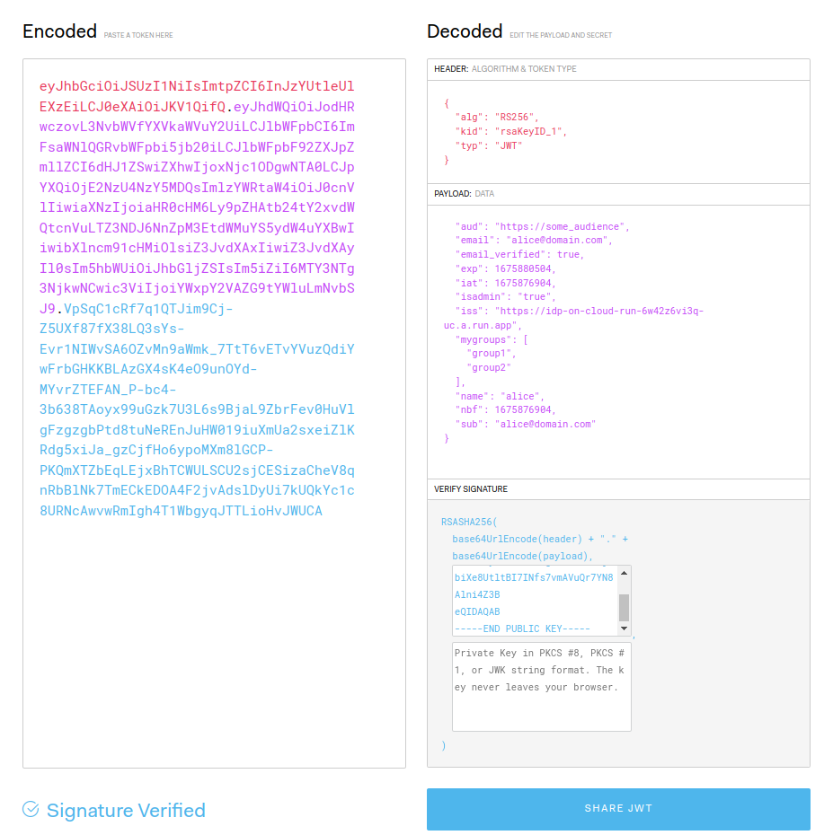

## DIY OIDC Server 

Simple `OIDC` server which will can issue arbitrary `JWT` claims.

The intent of this application is to provide a test harness against which you can authenticate any arbitrary system capable of supporting OIDC.

This OIDC server does not require authentication to get a token; it will simply sign and issue an OIDC token with whatever claims you need and pass though to it.

Basically, its a test app and needless to say **do not** use this in production...

>> this repo is not supported by google

### QuickStart

```bash
# i'm currently running it on cloud run here but you are free to deploy it on your own (see steps later on in the article)
# export URL=`gcloud run services describe idp-on-cloud-run --region=us-central1 --format="value(status.url)"`
export URL="https://idp-on-cloud-run-6w42z6vi3q-uc.a.run.app"

git clone https://github.com/salrashid123/diy_oidc.git
cd diy_oidc/

export IAT=`date -u +%s`
export EXP=`date -u +%s -d "+3600 seconds"`
export EMAIL="alice@domain.com"
export SUB="alice@domain.com"
export ISS=$URL
export NAME="alice"
export AUD="https://some_audience"
envsubst < "templates/jwt.tmpl" > "/tmp/jwt.json"

export JWT_TOKEN=`curl -s -X POST -d @/tmp/jwt.json  $URL/token`
echo $JWT_TOKEN
```

You can view the contents of the JWT by decoding `$JWT_TOKEN` using [jwt.io](jwt.io) debugger

A sample `JWT` may look like

```json
{
  "alg": "RS256",
  "kid": "123456",
  "typ": "JWT"
}
{
  "aud": "https://some_audience",
  "email": "alice@domain.com",
  "email_verified": true,
  "exp": 1675693406,
  "iat": 1675689806,
  "isadmin": "true",
  "iss": "https://idp-on-cloud-run-6w42z6vi3q-uc.a.run.app",
  "mygroups": [
    "group1",
    "group2"
  ],
  "name": "alice",
  "nbf": 1675689806,
  "sub": "alice@domain.com"
}
```

### .well-known and JWK Metadata Endpoints

As with any self-respecting OIDC server, it necessarily surfaces the [.well-known](https://www.rfc-editor.org/rfc/rfc8414.html) endpoints

- `.well-known/openid-configuration` endpoint will print out the standard oidc configuration 

- `/certs` will return the `JWK` formatted public key used for `JWT` verification

- `/token` endpoint will sign whatever `well-formed` JSON file is sent via POST


```json
$ curl -s https://idp-on-cloud-run-6w42z6vi3q-uc.a.run.app/.well-known/openid-configuration |jq '.'
{
  "issuer": "https://idp-on-cloud-run-6w42z6vi3q-uc.a.run.app",
  "jwks_uri": "https://idp-on-cloud-run-6w42z6vi3q-uc.a.run.app/certs",
  "id_token_signing_alg_values_supported": [
    "RS256"
  ],
  "response_types_supported": [
    "id_token"
  ],
  "subject_types_supported": [
    "public"
  ]
}
```

While the certificates in `JWK` format is available at

```json
$ curl -s https://idp-on-cloud-run-6w42z6vi3q-uc.a.run.app/certs | jq '.'
{
  "keys": [
    {
      "alg": "RS256",
      "e": "AQAB",
      "kid": "123456",
      "kty": "RSA",
      "n": "qqrpBHkLN4vT6g279KYTnnbKWHIEa-fK04wlamlrALQpV6QGfIrPwSgU_ElRFpsPJYWxCvEtYS01lBC70IeAhObR5DY9Z-jTvhk1tA-VrxyEhAHLuCuCsAPLow4ZSJ-aB0vZuUtaV9-qO-0gyJEG9y_5FKT51Tbr0INtjDASH43seoQtsPDG2tnKEj9r7jOLUNehj5j4Dgv-sJMGe3EyKlw7p6vsIhsU23v0VrTxdHGuelzplxCUQJoPRSxgepYyVmfrB12XJ5uJtLhYwuTbFb3BIUyswBtxtGcigvk_ftkuSQjubiXe8UtltBI7INfs7vmAVuQr7YN8Alni4Z3BeQ",
      "use": "sig"
    }
  ]
}
```

You can ofcourse deploy your own server with your own certs...just change the certs in `server.go` and deploy wherever.

### Deploy your own IDP

If you want to deploy your own server on `cloud run`, simply run:

```bash
cd idp_server/

gcloud run deploy   --platform=managed  \
 --region=us-central1   --allow-unauthenticated  \
 --source .   idp-on-cloud-run
 ```

Or you can just run the docker file or app on any internal server thats accessible (the issue with running it standalone is that the `https://` cert should be trusted; cloud run makes it easy but is now internet-accessible)


### Verify

Included in this repo is a simple go app that will verify the default JWT format above.

To run

```log
$ go run main.go --jwtToken=$JWT_TOKEN
2023/02/06 08:52:12 Keys in JWT Set : [1]
2023/02/06 08:52:12      Found OIDC KeyID  123456
2023/02/06 08:52:12      OIDC doc has Audience [https://some_audience]   Issuer [https://idp-on-cloud-run-6w42z6vi3q-uc.a.run.app] and SubjectEmail [alice@domain.com]
```



---

#### References

I initially wrote this app as a side show to demo workload federation here:

* [Authenticating using Workload Identity Federation to Cloud Run, Cloud Functions](https://github.com/salrashid123/workload_federation_cloudrun_gcf#1--fake-oidc-server)
* [Hashicorp Consul JWT Auth](https://github.com/salrashid123/consul_jwt_auth#quickstart)
